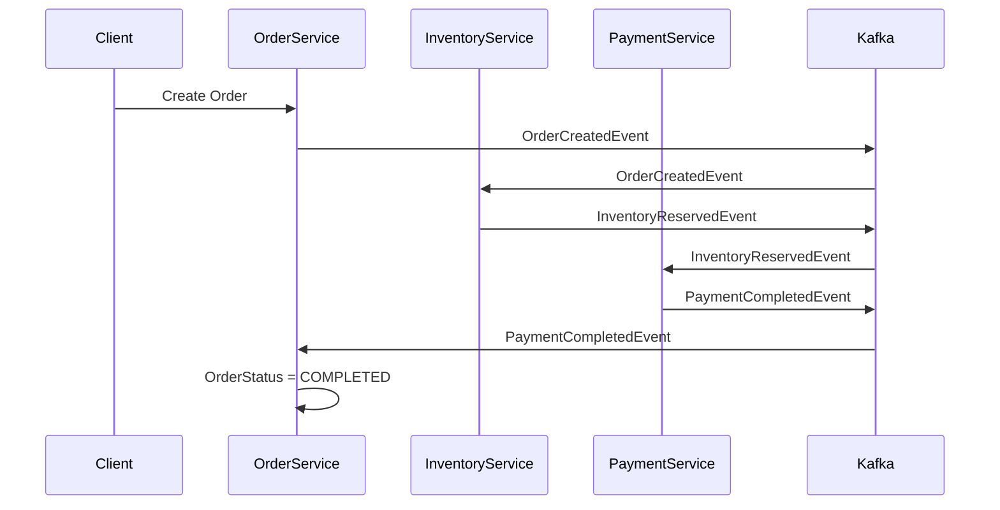
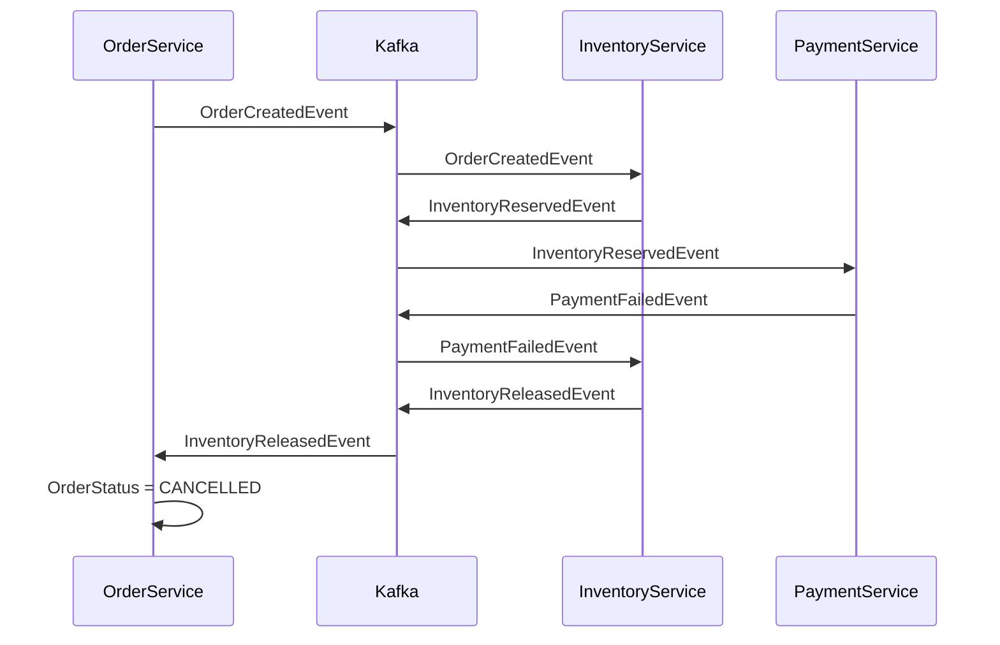

# Workflow

```
Client
│
▼
order-service
│
│ OrderCreatedEvent
▼
inventory-service
│
│ InventoryReservedEvent
▼
payment-service
│
│ PaymentCompletedEvent
▼
order-service
```

## Saga Flow



---

# Rollback

```
payment-service
  │
  │ PaymentFailedEvent
  ▼
inventory-service
  │
  │ InventoryReleasedEvent
  ▼
order-service
```

